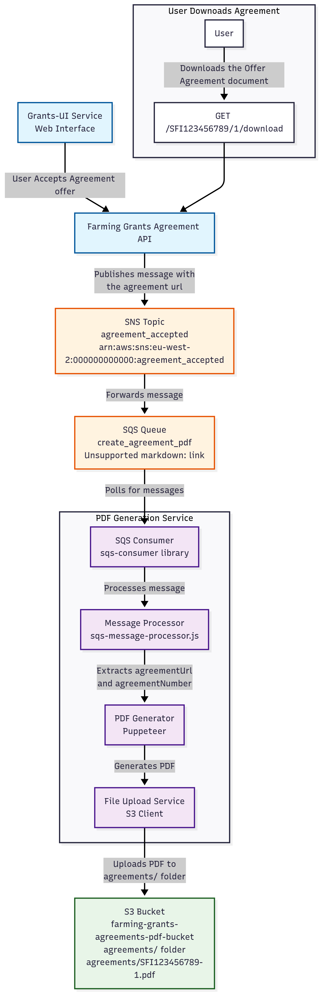

# farming-grants-agreements-pdf

[](https://sonarcloud.io/summary/new_code?id=DEFRA_farming-grants-agreements-pdf)
[](https://sonarcloud.io/summary/new_code?id=DEFRA_farming-grants-agreements-pdf)
[](https://sonarcloud.io/summary/new_code?id=DEFRA_farming-grants-agreements-pdf)

Core delivery platform Node.js Backend Template.

- [Architecture](#architecture)
- [Requirements](#requirements)
  - [Node.js](#nodejs)
- [Local Development](#local-development)
  - [Setup](#setup)
  - [Development](#development)
  - [Testing](#testing)
  - [Production](#production)
  - [Npm scripts](#npm-scripts)
  - [Update dependencies](#update-dependencies)
  - [Formatting](#formatting)
    - [Windows prettier issue](#windows-prettier-issue)
- [Docker](#docker)
  - [Development image](#development-image)
  - [Production image](#production-image)
  - [Docker Compose](#docker-compose)
  - [Viewing messages in LocalStack SQS](#viewing-messages-in-localstack-sqs)
  - [Dependabot](#dependabot)
  - [SonarCloud](#sonarcloud)
- [Licence](#licence)
  - [About the licence](#about-the-licence)

## Architecture



## Requirements

### Node.js

Please install [Node.js](http://nodejs.org/) `>= v22` and [npm](https://nodejs.org/) `>= v9`. You will find it
Easier to use the Node Version Manager [nvm](https://github.com/creationix/nvm)

To use the correct version of Node.js for this application, via nvm:

```bash
cd farming-grants-agreements-pdf
nvm use
```

## Local Development

### Setup

Install application dependencies:

```bash
npm install
```

### Development

To run the application in `development` mode run:

```bash
npm run dev
```

### Testing

To test the application run:

```bash
npm run test
```

### Production

To mimic the application running in `production` mode locally run:

```bash
npm start
```

### Npm scripts

All available Npm scripts can be seen in [package.json](./package.json)
To view them in your command line run:

```bash
npm run
```

### Update dependencies

To update dependencies use [npm-check-updates](https://github.com/raineorshine/npm-check-updates):

> The following script is a good start. Check out all the options on
> the [npm-check-updates](https://github.com/raineorshine/npm-check-updates)

```bash
ncu --interactive --format group
```

### Formatting

#### Windows prettier issue

If you are having issues with formatting of line breaks on Windows update your global git config by running:

```bash
git config --global core.autocrlf false
```

## Docker

### Development image

> [!TIP]
> For Apple Silicon users, you may need to add `--platform linux/amd64` to the `docker run` command to ensure
> compatibility fEx: `docker build --platform=linux/arm64 --no-cache --tag farming-grants-agreements-pdf`

Build:

```bash
docker build --target development --no-cache --tag farming-grants-agreements-pdf:development .
```

Run:

```bash
docker run -p 3556:3556 farming-grants-agreements-pdf:development
```

### Production image

Build:

```bash
docker build --no-cache --tag farming-grants-agreements-pdf .
```

Run:

```bash
docker run -p 3556:3556 farming-grants-agreements-pdf
```

### Docker Compose

A local environment with:

- Localstack for AWS services (S3, SQS)
- Redis
- This service.

```bash
docker compose up --build -d
```

### Viewing messages in LocalStack SQS

By default, our LocalStack monitor only shows message counts (`ApproximateNumberOfMessages`, `ApproximateNumberOfMessagesNotVisible`) for each queue. This is intentional, so we don’t interfere with the application’s consumers — pulling messages removes them from visibility until they are deleted or the visibility timeout expires.

If you want to peek at the actual messages (for debugging or development only), you can run:

```bash
docker compose exec localstack sh -lc '
  QURL=$(awslocal sqs get-queue-url \
    --queue-name create_agreement_pdf \
    --query QueueUrl --output text)

  awslocal sqs receive-message \
    --queue-url "$QURL" \
    --max-number-of-messages 10 \
    --wait-time-seconds 1 \
    --message-attribute-names All \
    --attribute-names All
'
```

### Dependabot

We have added an example dependabot configuration file to the repository. You can enable it by renaming
the [.github/example.dependabot.yml](.github/example.dependabot.yml) to `.github/dependabot.yml`

### SonarCloud

Instructions for setting up SonarCloud can be found in [sonar-project.properties](./sonar-project.properties).

## API endpoints

| Endpoint       | Description |
| :------------- | :---------- |
| `GET: /health` | Health      |

## Licence

THIS INFORMATION IS LICENSED UNDER THE CONDITIONS OF THE OPEN GOVERNMENT LICENCE found at:

<http://www.nationalarchives.gov.uk/doc/open-government-licence/version/3>

The following attribution statement MUST be cited in your products and applications when using this information.

> Contains public sector information licensed under the Open Government license v3

### About the licence

The Open Government Licence (OGL) was developed by the Controller of Her Majesty's Stationery Office (HMSO) to enable
information providers in the public sector to license the use and re-use of their information under a common open
licence.

It is designed to encourage use and re-use of information freely and flexibly, with only a few conditions.

.
